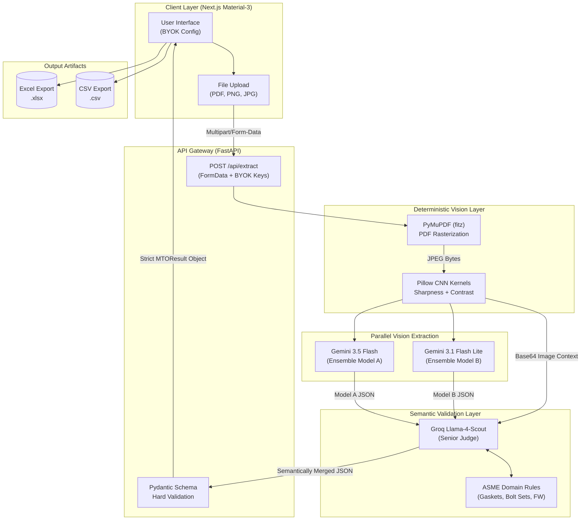

# ArchPipeline — AI-Driven Piping Isometric MTO Extraction

An end-to-end, production-grade AI pipeline for extracting Material Take-Offs (MTO) from piping isometric drawings. Built as a technical assessment for PathNovo, the system is designed to address the fundamental challenge of deploying generative AI in a precision-engineering context: eliminating hallucinations and producing deterministic, ASME-compliant output.

---

## Assessment Checklist

| Requirement | Status | Implementation Detail |
|---|---|---|
| Upload an isometric drawing (image or PDF) | Done | Accepts PNG, JPG, PDF up to 20 MB |
| Extract piping components (pipes, fittings, flanges, valves) | Done | Tri-Model ensemble extraction with BOM-table priority |
| Output an MTO table with correct columns | Done | Item No, Category, Description, NPS, Schedule, Material Spec, End Type, Qty, Unit, Length, Confidence, Remarks |
| Domain accuracy (ASME standards) | Done | Groq Llama-4 enforces Gasket/Bolt Set ratios per flanged joint, pipe units in M, discrete items in EA |
| Confidence scores | Done | Mathematically derived from model consensus, not LLM-generated guesses |
| Export to CSV | Done | Available from the results header |
| Export to Excel | Done | Native `.xlsx` generation via `xlsx` library |
| PDF support | Done | PyMuPDF rasterizes the first page to a high-resolution JPEG before processing |
| Human-in-the-Loop editing | Done | Table cells are `contentEditable`, allowing correction of AI output before export |
| Visual bounding box overlays | Done | Items with detected bounding boxes are rendered as overlays on the drawing preview |
| Field Weld (FW) counting | Done | Explicitly prompted in Gemini and Groq; tallied in the Summary section |
| Graceful failure / fallback | Done | If all API keys fail, the API returns a structured mock MTO instead of crashing the UI |
| Rate limit resilience | Done | Round-Robin key rotation handles 429 errors transparently |
| Bring Your Own Key (BYOK) | Done | Frontend UI accepts Gemini Key 1, Key 2, and Groq Key; bypasses server-side env vars |
| Docker support | Done | `Dockerfile` for backend and frontend; `docker-compose.yml` for full-stack local startup |

---

## System Architecture



---

## Pipeline Design

### Stage 1: Pre-Processing (Deterministic)

Before any LLM processes the drawing, two deterministic stages run:

1. **PDF Rasterization (`PyMuPDF`):** If the upload is a PDF, `fitz` opens the document and renders the first page as a 300 DPI JPEG using a 2x matrix scale. This produces a high-fidelity raster image from a vector PDF without losing resolution on fine piping symbols.

2. **Convolutional Image Enhancement (`Pillow`):** The resulting image is passed through two sequential Pillow enhancement kernels:
   - `ImageEnhance.Contrast(1.5)` — widens the luminance gap between the background grid and the piping routing lines, which are often printed in thin, faded black on scanned drawings.
   - `ImageEnhance.Sharpness(2.0)` — applies edge sharpening to make text annotations (NPS tags, valve references, weld symbols) crisper and more readable for OCR.

   This directly addresses the root cause of vision model failures on engineering drawings: low-contrast, small-font text that standard models misread or skip entirely.

### Stage 2: Ensemble Extraction (Parallel)

Two Gemini vision models receive the processed image simultaneously via `asyncio.gather`:

- **Gemini 3.5 Flash:** Higher capability model; prioritized for reading complex BOM tables.
- **Gemini 3.1 Flash Lite:** Faster, lower-cost model; acts as the second opinion in the ensemble.

Both models are given the same structured prompt that enforces:
- BOM table priority (read the printed materials list before interpreting the sketch)
- Zero-guessing for non-isometric images
- Field Weld enumeration
- JSON schema compliance (response MIME type is forced to `application/json`)

If one model encounters a 429 rate-limit error, the Round-Robin key rotation cycles to the next available API key and retries automatically.

### Stage 3: Semantic Merge and Validation (Groq Agentic Judge)

This is the core architectural innovation. Rather than using a deterministic string-matching algorithm to merge the two JSON outputs, both Model A's output, Model B's output, and the original image are passed together to **Groq Llama-4-Scout**.

Groq acts as a multimodal "Senior Engineer" with explicit instructions:
1. **Semantic Deduplication:** Recognizes that `Check Valve` and `Swing Check Valve ASME 150#` are the same row and merges them.
2. **Visual Conflict Resolution:** If Model A says 3 flanges and Model B says 4, Groq is instructed to look at the image and count directly, then assign a lower confidence score to the resolved item.
3. **ASME Physics Enforcement:** After resolving the item list, Groq checks that every flanged joint has exactly 1 Gasket (EA) and 1 Bolt Set (SET). It adds missing rows if needed.
4. **Bounding Box Generation:** For any item Groq had to manually verify in the image, it is instructed to output normalized `[ymin, xmin, ymax, xmax]` coordinates which are rendered as overlays in the frontend.

### Stage 4: Hard Validation (Pydantic)

The Groq output is passed through a strict Pydantic `MTOResult` schema before reaching the frontend. This guarantees the API response is always a well-typed object regardless of any edge-case JSON quirks from the LLM output. If Pydantic validation fails, the pipeline gracefully returns the richer of the two raw Gemini outputs rather than crashing.

---

## Known Limitations and Future Work

| Limitation | Root Cause | Proposed Solution |
|---|---|---|
| Bounding boxes are approximate | Standard LLMs lack pixel-precise spatial reasoning | Replace with a two-stage YOLOv8 detection model trained on ASME piping symbols |
| Confidence scores are semantic estimates | Groq assigns confidence based on description clarity, not pixel-level certainty | Integrate a dedicated uncertainty quantification layer |
| Single-page PDF only | Current rasterizer loads only `page[0]` | Extend to detect and process all drawing sheets in multi-page PDFs |
| No persistent storage | Each upload is stateless | Add a PostgreSQL or SQLite backend to store extraction history per project |
| Graph-level routing is not extracted | LLMs see the drawing as a raster image, not a node-edge graph | Convert drawings to vector SVG, parse into a Graph Neural Network (GNN) for deterministic routing and isometric traversal |

---

## Local Setup

### Option A: Docker Compose (Recommended)

```bash
docker-compose up --build
```

- Dashboard: `http://localhost:3000`
- API: `http://localhost:8000`

### Option B: Manual

**Backend**
```bash
cd backend
pip install -r requirements.txt
uvicorn main:app --reload
```

**Frontend**
```bash
cd frontend
npm install
npm run dev
```

**Environment Variables (backend/.env)**
```
GEMINI_API_KEYS=your_key_1,your_key_2
GROQ_API_KEY=your_groq_key
```

Alternatively, enter keys directly in the UI using the BYOK panel on the dashboard home page.
