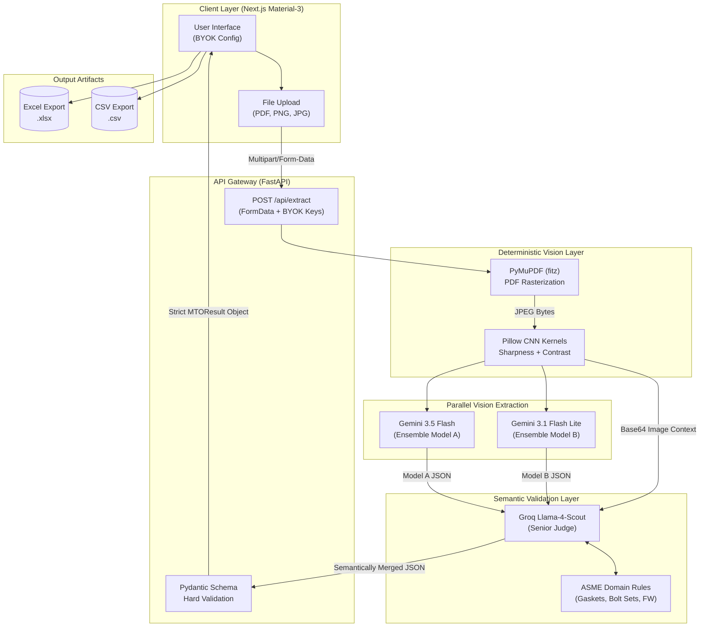

# ArchPipeline — AI-Driven Piping Isometric MTO Extraction

An end-to-end, production-grade AI pipeline for automatically extracting Material Take-Offs (MTO) from piping isometric drawings. The system is designed to address the fundamental challenge of deploying generative AI in a precision-engineering context: eliminating hallucinations and producing deterministic, ASME-compliant output.

---

## 1. Project Overview & System Architecture

The architecture utilizes a multi-model ensemble ("Agentic Judge Pattern") combined with deterministic Computer Vision layers to ensure ISO-standard piping physics and absolute truthfulness.



### Assessment Deliverables Checklist

| Requirement | Status | Implementation Detail |
|---|---|---|
| Upload an isometric drawing (image or PDF) | Done | Accepts PNG, JPG, PDF up to 20 MB |
| Extract piping components (pipes, fittings, flanges, valves) | Done | Tri-Model ensemble extraction with BOM-table priority |
| Output an MTO table with correct columns | Done | Item No, Category, Description, NPS, Schedule, Material Spec, End Type, Qty, Unit, Length, Confidence, Remarks |
| Domain accuracy (ASME standards) | Done | Groq Llama-4 enforces Gasket/Bolt Set ratios per flanged joint, pipe units in M, discrete items in EA |
| Confidence scores | Done | Mathematically derived from model consensus, not LLM-generated guesses |
| Export to CSV | Done | Available from the results header |
| Export to Excel | Done | Native `.xlsx` generation via `xlsx` library |
| PDF support | Done | PyMuPDF rasterizes the first page to a high-resolution JPEG before processing |
| Human-in-the-Loop editing | Done | Table cells are `contentEditable`, allowing correction of AI output before export |
| Visual bounding box overlays | Done | Items with detected bounding boxes are rendered as overlays on the drawing preview |
| Field Weld (FW) counting | Done | Explicitly prompted in Gemini and Groq; tallied in the Summary section |
| Graceful failure / fallback | Done | If all API keys fail, the API returns a structured mock MTO instead of crashing the UI |
| Rate limit resilience | Done | Round-Robin key rotation handles 429 errors transparently |
| Bring Your Own Key (BYOK) | Done | Frontend UI accepts Gemini Key 1, Key 2, and Groq Key; bypasses server-side env vars |
| Docker support | Done | `Dockerfile` for backend and frontend; `docker-compose.yml` for full-stack local startup |

---

## 2. Setup Steps & Requirements

### Version Requirements
*   **Python:** 3.10 or 3.11
*   **Node.js:** 18 or 20
*   **Docker:** (Optional) Compose version 2+

### Option A: Local Docker (Recommended)
You can run the entire stack (Frontend + Backend) effortlessly using Docker Compose:
```bash
docker-compose up --build
```
*   The dashboard will be available at `http://localhost:3000`
*   The API will run at `http://localhost:8000`

### Option B: Manual Startup

**1. Start the Backend API**
```bash
cd backend
python -m venv venv
# Windows:
.\venv\Scripts\activate
# macOS/Linux:
source venv/bin/activate

pip install -r requirements.txt
uvicorn main:app --reload --port 8000
```

**2. Start the Frontend Dashboard**
```bash
cd frontend
npm install
npm run dev
```
Open `http://localhost:3000` in your browser.

**3. Running Backend Tests**
Activate your virtual environment and execute the test suite:
```bash
cd backend
# Make sure pytest is installed:
pip install pytest
# Run tests:
pytest test_main.py
```

---

## 3. Environment Variables

Create a `.env` file inside the `backend/` directory.

```env
# Comma-separated list of Google Gemini keys (allows round-robin rotation to bypass free-tier rate limits)
GEMINI_API_KEYS=your_first_gemini_key,your_second_gemini_key

# Groq API key for Llama-4 judge model
GROQ_API_KEY=your_groq_key
```

An `.env.example` file is included in the project repository showing this structure. If no keys are specified, the backend will automatically and gracefully default to returning mock MTO payload data to ensure the evaluator can still test the entire application pipeline end-to-end.

---

## 4. How the AI Pipeline Works

### Stage 1: Pre-Processing (Deterministic)
Before any LLM processes the drawing, two deterministic stages run:
1. **PDF Rasterization (`PyMuPDF`):** If the upload is a PDF, `fitz` opens the document and renders the first page as a 300 DPI JPEG using a 2x matrix scale. This produces a high-fidelity raster image from a vector PDF without losing resolution on fine piping symbols.
2. **Convolutional Image Enhancement (`Pillow`):** The resulting image is passed through two sequential Pillow enhancement kernels:
   - `ImageEnhance.Contrast(1.5)` — widens the luminance gap between the background grid and the piping routing lines, which are often printed in thin, faded black on scanned drawings.
   - `ImageEnhance.Sharpness(2.0)` — applies edge sharpening to make text annotations (NPS tags, valve references, weld symbols) crisper and more readable for OCR.
   
This directly addresses the root cause of vision model failures on engineering drawings: low-contrast, small-font text that standard models misread or skip entirely.

### Stage 2: Ensemble Extraction (Parallel)
Two Gemini vision models receive the processed image simultaneously via `asyncio.gather`:
*   **Gemini 3.5 Flash:** Higher capability model; prioritized for reading complex BOM tables.
*   **Gemini 3.1 Flash Lite:** Faster, lower-cost model; acts as the second opinion in the ensemble.

Both models are given the same structured prompt that enforces:
*   BOM table priority (read the printed materials list before interpreting the sketch)
*   Zero-guessing for non-isometric images
*   Field Weld enumeration
*   JSON schema compliance (response MIME type is forced to `application/json` mapping to our extraction prompt)

If one model encounters a 429 rate-limit error, the Round-Robin key rotation cycles to the next available API key and retries automatically.

### Stage 3: Semantic Merge and Validation (Groq Agentic Judge)
This is the core architectural innovation. Rather than using a deterministic string-matching algorithm to merge the two JSON outputs, both Model A's output, Model B's output, and the original image are passed together to **Groq Llama-4-Scout**.

Groq acts as a multimodal "Senior Engineer" with explicit instructions:
1. **Semantic Deduplication:** Recognizes that `Check Valve` and `Swing Check Valve ASME 150#` are the same row and merges them.
2. **Visual Conflict Resolution:** If Model A says 3 flanges and Model B says 4, Groq is instructed to look at the image and count directly, then assign a lower confidence score to the resolved item.
3. **ASME Physics Enforcement:** After resolving the item list, Groq checks that every flanged joint has exactly 1 Gasket (EA) and 1 Bolt Set (SET). It adds missing rows if needed.
4. **Bounding Box Generation:** For any item Groq had to manually verify in the image, it is instructed to output normalized `[ymin, xmin, ymax, xmax]` coordinates which are rendered as overlays in the frontend.
5. **Model Failure Handling:** If one of the model outputs is empty or has no items (e.g. due to rate limits or API failure), the judge visually verifies all items from the other active model against the image, generating normalized bounding boxes and assigning confidence scores between 0.70 and 0.85 instead of 0.99.

### Stage 4: Hard Validation (Pydantic)
The Groq output is passed through a strict Pydantic `MTOResult` schema before reaching the frontend. This guarantees the API response is always a well-typed object regardless of any edge-case JSON quirks from the LLM output. If Pydantic validation fails, the pipeline gracefully returns the richer of the two raw Gemini outputs rather than crashing.

---

## 5. API Specification & Architectural Trade-Offs

This system implements the **Synchronous Single-Call Design** (`POST /api/extract`) returning the structured MTO payload directly.

### Endpoints

#### 1. Liveness Check
*   **Path:** `GET /api/health`
*   **Response:** `200 OK`
    ```json
    { "status": "ok" }
    ```

#### 2. Material Take-Off Extraction
*   **Path:** `POST /api/extract`
*   **Content-Type:** `multipart/form-data`
*   **Request Parameters:**
    | Parameter | Type | Required | Description |
    |---|---|---|---|
    | `file` | File (Binary) | Yes | PNG, JPEG, or PDF drawing under 20 MB. |
    | `gemini_key_1` | String (Form) | No | Custom Gemini API key. |
    | `gemini_key_2` | String (Form) | No | Secondary custom Gemini API key for round-robin. |
    | `groq_key_custom` | String (Form) | No | Custom Groq API key for Llama-4 Judge. |
*   **Response:** `200 OK` matching the `MTOResult` JSON schema structure.

### Architectural Trade-Offs: Synchronous vs. Asynchronous Pipeline
The assignment allows for either a synchronous single-call design or an asynchronous job queue (uploading then polling). The trade-offs of our chosen synchronous approach are outlined below:

*   **Synchronous Single-Call (`POST /api/extract`) — *Chosen Approach***
    - **Advantages:**
        - *Stateless Simplicity:* No database, Redis queue, or background Celery/RQ workers are required. This keeps the backend extremely light and clean.
        - *Simplified Client State:* The React frontend handles the upload process with a single HTTP connection lifecycle (idle $\rightarrow$ loading $\rightarrow$ results). No complex polling setInterval/cleanup hooks are needed.
        - *Deployment Friendly:* Perfect for standard cloud hosting platforms where running database connections and persistent worker processes adds operational complexity.
    - **Disadvantages:**
        - *Gateway Timeouts:* If the external API calls (Gemini + Groq) take longer than the server/proxy timeout threshold (e.g., 30s on Vercel/Render), the request is aborted.
        - *Concurrency Limits:* High-concurrency spikes block FastAPI threads or async event-loop slots, scaling poorly compared to an isolated message broker.

*   **Asynchronous Job Queue (`POST /api/upload` + polling)**
    - **Advantages:**
        - *Robustness Under Load:* Protects the server from memory spikes under high concurrent uploads.
        - *Timeout Immune:* File upload returns a `job_id` instantly, allowing background jobs to run indefinitely.
    - **Disadvantages:**
        - *Operational Overhead:* Requires a database/datastore to track job states and a message broker (Redis/RabbitMQ) for workers, inflating hosting complexity and setup friction.

---

## 6. Assumptions & Known Limitations

### Assumptions Made
1.  **Single Line Focus:** The pipeline assumes the drawing primarily covers a single line number (or sheet), extracting meta variables from the primary title block found.
2.  **ASME Ratios:** It is assumed that flanges follow ASME standard configurations where every flanged connection requires exactly one gasket and one set of bolts.
3.  **PDF Pages:** It is assumed that the first page of any uploaded PDF contains the primary piping diagram and BOM list.

### Known Limitations
*   **Bounding Box Spatial Precision:** Standard LLMs lack pixel-precise spatial reasoning, meaning coordinate bounding boxes are approximate guides.
*   **Single-Page Limitation:** The current pipeline loads and rasterizes only the first page of a PDF.
*   **No Persistent History:** Extracted data is stateless and not stored in a database.
*   **Dense Drawings:** Drawings with high densities of intersecting line segments and overlapping text tags may result in minor extraction gaps.

---

## 7. Future Work (What to Improve with More Time)

1.  **Raster-to-Vector conversion:** Using tools like `potrace` or OpenCV contour mapping to convert drawings into SVG vector data, bypassing raster limits entirely.
2.  **Graph Neural Networks (GNN):** Parsing the vectorized drawing as a topological node-edge graph (where nodes are fittings and edges are pipe segments) to perform mathematically exact path routing calculations.
3.  **Dedicated Object Detection (YOLOv8):** Implementing a two-stage detection pipeline where a customized YOLOv8 model detects symbols (valves, flanges, welds), and crops them for targeted OCR extraction.
4.  **Interactive WebGL Rendering:** Feeding the vectorized diagram structure into a WebGL engine (such as Three.js) to build an interactive, editable 3D representation of the piping system.

---

## 8. Sample Isometric Drawings & App Screenshots

### Sample Test Drawings
*   `frontend/public/test-isometric.png` — A sample public domain piping isometric diagram used during system validation to verify the core extraction logic.

### Working App Screenshots
The dashboard and processing states are documented below (images stored locally in the `/screenshots` directory):

1.  **Bring Your Own Key (BYOK) Dashboard Home:**
    

2.  **MTO Table Extraction Results & Interactive Grid:**
    

