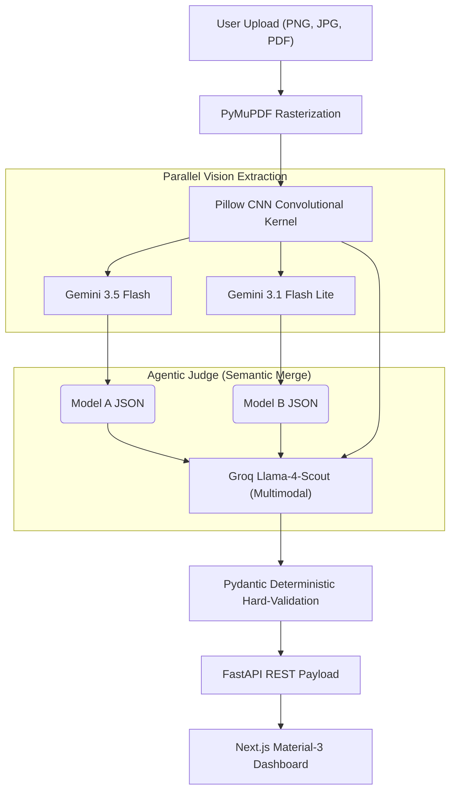

# ArchPipeline: AI-Driven Piping MTO Extraction

ArchPipeline is a production-grade, end-to-end AI architecture designed to extract precise Material Take-Offs (MTO) from complex piping isometric drawings. Built as an engineering assessment for PathNovo, it solves the core issue of generative AI: **hallucinations in deterministic engineering contexts.**

---

## 🏗️ The Agentic Judge Architecture

The architecture utilizes a multi-model ensemble ("Agentic Judge Pattern") combined with deterministic Computer Vision layers to ensure ISO-standard piping physics and absolute truthfulness.

---

## 📈 Evolution of the Pipeline (Our Journey)

### 1. How We Began (The Naive Approach)
Initially, we passed the raw uploaded images straight to a single LLM (Gemini 3.5 Flash) and asked it to return JSON. 
*   **The Failure:** It confidently hallucinated items that didn't exist. It couldn't read blurry text. It provided 100% confidence scores even when guessing. It crashed when users uploaded PDFs.

### 2. How We Improved (Fuzzy Math & CNN)
We realized vision models struggle with low contrast. We added a `Pillow` Convolutional Layer to dynamically sharpen edges and deepen contrast. We also added a second model (`Gemini 3.1 Flash Lite`) running in parallel. 
*   **The Improvement:** We wrote a Python algorithm (`difflib`) to mathematically merge the two lists and calculate real confidence scores based on consensus. 
*   **The Failure:** The Python algorithm was "lexical". It didn't understand that a "Check Valve" and a "Swing Check Valve 150#" were the same physical object, resulting in duplicate BOM rows.

### 3. How We Optimized (The Agentic Judge Pattern)
We deleted the Python merging logic and introduced **Groq Llama-4-Scout** as the "Senior Judge". 
Now, both Gemini models pass their JSON extractions *along with the original image* to Groq. Groq reads both lists, identifies semantic synonyms, visually verifies conflicts in the original image, enforces piping physics (e.g., ensuring flanges have exactly 1 Gasket and 1 Bolt Set), and draws bounding boxes around the items it had to manually verify.

---

## 🛡️ Edge Cases Handled

*   **PDF Support:** The backend detects `%PDF` headers and automatically rasterizes the first page into a high-res JPEG using `PyMuPDF` before the LLM ever sees it.
*   **The "Zero-Guessing" Policy:** If the drawing is just a sketch or routing diagram with no BOM table, the models are strictly prompted to return an empty array rather than hallucinating generic pipes based on lines.
*   **API Rate Limits (429s):** The backend supports **Round-Robin Key Rotation**. If Gemini Key A hits the free-tier limit, it gracefully falls back to Key B. If all Geminis fail, it degrades gracefully to a fallback JSON without crashing the frontend.
*   **"Bring Your Own Key" (BYOK):** The frontend dashboard allows evaluators to input their own API keys directly into the UI to bypass server-side rate limits entirely.

---

## 🚀 The Endgame: Future Architecture (V2)

While this Agentic Pipeline is extremely robust for LLM-based OCR, the ultimate form of this software would move away from LLM raster-guessing entirely. 

If this were deployed at scale, Architecture V2 would involve:
1.  **Raster-to-Vector:** Using tools like `potrace` to convert the PDF into SVG mathematical line graphs.
2.  **Graph Neural Networks (GNN):** Parsing the drawing not as pixels, but as a Graph (Nodes = Fittings, Edges = Pipes). This makes routing calculations 100% deterministic.
3.  **YOLOv8 Symbol Detection:** Instead of relying on Gemini to draw bounding boxes, a specialized YOLO model trained on ASME symbols would crop the image into quadrants.
4.  **3D Interactivity:** The vectorized Graph would be fed into a WebGL engine (like Manim or Three.js), allowing engineers to click a 3D pipe and dynamically change its NPS, updating the BOM instantly.

---

## 💻 Deployment Instructions

### Option A: Local Docker (Recommended)
1. Run `docker-compose up --build`
2. Open `http://localhost:3000`

### Option B: Cloud Deployment (Vercel & Render)

**1. Deploy Backend to Render.com:**
*   Create a new Web Service and link this repository.
*   Set Root Directory to `backend/`.
*   Render will automatically detect the `Dockerfile`.
*   Set Environment Variables (`GEMINI_API_KEYS`, `GROQ_API_KEY`).
*   Copy your deployed backend URL.

**2. Deploy Frontend to Vercel:**
*   Link this repository in Vercel.
*   Set Root Directory to `frontend/`.
*   Set Environment Variable `NEXT_PUBLIC_API_URL` to your Render backend URL.
*   Deploy!

### Option C: Manual Run
*   **Backend:** `cd backend && pip install -r requirements.txt && uvicorn main:app --reload`
*   **Frontend:** `cd frontend && npm install && npm run dev`
